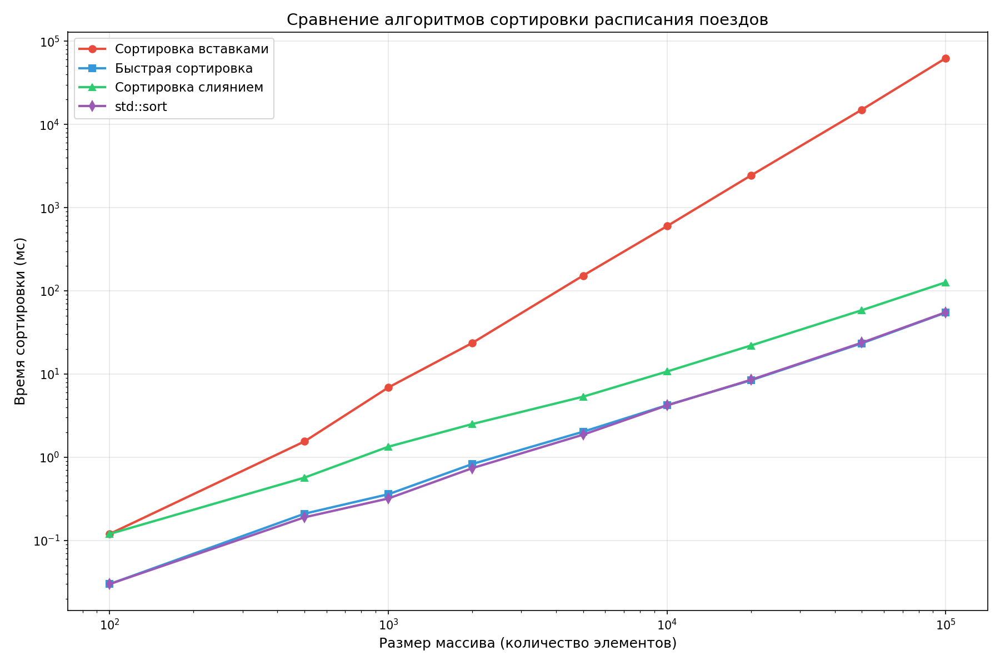

# Сортировка расписания поездов

Лабораторная работа по методам программирования. Сравнение алгоритмов сортировки на массиве объектов.

## Алгоритмы
- Сортировка вставками 
- Быстрая сортировка
- Сортировка слиянием
- std::sort

## Данные
Массив объектов Train с полями:
- Номер поезда
- Дата отправления
- Тип поезда (скорый, пассажирский, товарный)
- Время отправления
- Время в пути

## Сборка и запуск
```cmd
cl /O2 /EHsc generate_data_relevant.cpp
.\generate_data_relevant.exe

cl /O2 /EHsc main_relevant.cpp
.\main_relevant.exe
```

## Результаты


## Документация
Генерация Doxygen:
```cmd
doxygen Doxyfile
```
